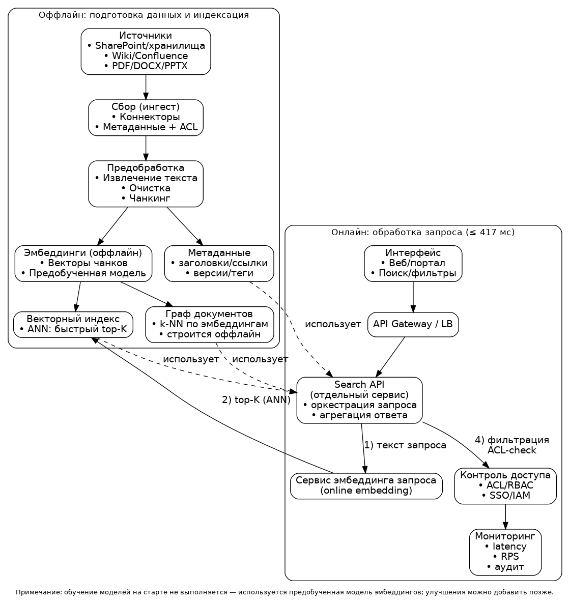
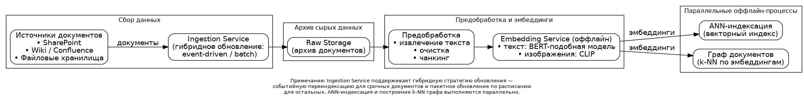

# отчет: Проектирование ML-системы — Задание 10
### Курс Проектирование систем машинного обучения
### Студент: Илья Рожков Алексеевич
### Группа: МЛ-2025

# Введение и постановка задачи
Проектируется система для семантического поиска по внутренним корпоративным документам крупной организации.
Система должна обеспечивать быстрый и точный поиск по отчётам, презентациям, внутренним вики-страницам и другим источникам знаний, используя векторный поиск на основе заранее рассчитанных эмбеддингов документов.
Обработка запроса пользователя должна выполняться без обращения к тяжёлым генеративным моделям в режиме онлайн: используются компактные модели для получения эмбеддингов запросов и оптимизированный векторный индекс. Поиск должен учитывать сложную модель прав доступа, чтобы каждый пользователь видел только те документы, к которым у него есть разрешение.
Система должна работать под высокой нагрузкой и масштабироваться под большое количество пользователей в корпорации.

# Бизнес-цели
- 1. **Почти мгновенный доступ к информации**
Сократить среднее время поиска внутренних документов (регламентов, отчётов, презентаций, вики-страниц) с нескольких минут до **долей секунды** благодаря высокопроизводительному семантическому поиску с задержкой не более **417 мс**.
Это **повышает скорость принятия решений** и **снижает операционные задержки** в работе сотрудников.
- 2. **Улучшение релевантности результатов поиска**
Повысить точность и полезность выдачи за счёт использования мл поиска, чтобы сотрудники находили **нужные документы с первого запроса**.
Цель — уменьшить количество повторных запросов и повысить эффективность работы.
- 3. **Поддержка большого числа пользователей без деградации качества**
Обеспечить стабильную работу системы для **1,288,472 DAU** и **пиковых 16,994 RPS**, сохраняя высокую скорость и релевантность поиска.
Это снижает нагрузку на внутренние службы поддержки и повышает вовлечённость пользователей в использование корпоративного хранилища знаний.

**Требования к системе:**
- Задержка (latency) ответа не должна превышать **417 мс**.
- Система должна обслуживать **1,288,472 активных пользователей в день (DAU)**, с пиковой нагрузкой в **16,994 запросов в секунду (RPS)**.
- Система должна быть масштабируемой и отказоустойчивой.

# Часть 1: Формулировка ML-задачи и выбор модели
- **1. Определение ML-задачи**
Задачу можно сформулировать как задачу ранжирования документов (Learning-to-Rank) в рамках семантического поиска.
Для каждого пользовательского запроса система должна упорядочить набор доступных пользователю документов по степени их релевантности.
Поиск выполняется с учётом семантического сходства между запросом и документами, а также ограничений доступа (пользователь может видеть только разрешённые документы).

## Входные данные:
Текстовый запрос пользователя на естественном языке.
Корпус внутренних документов (отчёты, презентации, вики), представленных в виде текстовых фрагментов.
Метаданные документов:
идентификаторы проектов и команд;
информация о правах доступа (ACL / RBAC);
тип документа, дата создания и версия.
Выходные данные:
Упорядоченный список документов (или фрагментов документов), релевантных запросу пользователя.
Для каждого документа — числовой скор релевантности.

## Целевая переменная:
Целевой переменной является оценка релевантности документа запросу.
В явном виде она может отсутствовать, поэтому используется одна из следующих форм:
- Неявная обратная связь пользователей:
- клики по результатам поиска;
- время просмотра документа;
- повторные запросы.
## Слабая разметка:
- бинарная метка релевантности (релевантен / нерелевантен);
- порядковая оценка (например, 0 — нерелевантен, 1 — частично релевантен, 2 — релевантен).
## Прокси-таргет:
- Семантическое сходство между эмбеддингом запроса и эмбеддингом документа, используемое как обучающий сигнал.
- Таким образом, задача не предполагает существование «идеального ответа», а оптимизируется по метрикам качества ранжирования (Precision@k, recal@K).

# 2. Выбор модели
Рассмотрим два подхода к построению системы семантического поиска по внутренним корпоративным документам.
## Подход 1: Прямой семантический поиск по эмбеддингам (Vector Similarity Search)
В данном подходе каждый документ и пользовательский запрос представляются в виде векторных эмбеддингов, полученных с помощью компактной нейросетевой модели.
Поиск осуществляется путём вычисления близости между эмбеддингом запроса и эмбеддингами документов с использованием приближённого поиска ближайших соседей (Approximate Nearest Neighbors).
### Преимущества:
- Очень высокая скорость поиска, что позволяет уложиться в ограничение по задержке 417 мс.
- Простая и хорошо масштабируемая архитектура.
- Возможность предварительного вычисления эмбеддингов документов оффлайн.
- Минимальные вычислительные затраты в режиме онлайн.
### Недостатки:
- Релевантность определяется только локальным сходством запроса и документа.
- Не учитываются глобальные связи между документами (темы, контекст, совместное использование).
- Сложно улучшать качество без увеличения размерности эмбеддингов или сложности модели.
## Подход 2: Семантический поиск с использованием графа документов на основе эмбеддингов
В данном подходе документы представляются в виде вершин графа, а рёбра формируются оффлайн на основе семантической близости их эмбеддингов (например, по k-ближайшим соседям).
Граф документов строится заранее на этапе подготовки данных и отражает семантические связи между документами.
В процессе поиска выполняется быстрый векторный retrieval для получения начального набора кандидатов, после чего используется навигация по предварительно построенному графу документов для уточнения и дополнения списка релевантных результатов.
### Преимущества:
- Более высокая релевантность за счёт учёта глобальной структуры корпуса документов.
- Возможность находить связанные документы, которые не являются ближайшими по векторному сходству.
- Улучшение качества поиска без использования тяжёлых моделей в режиме онлайн.
- Возможность объяснять результаты поиска через связи в графе.
- Навигация по графу позволяет ограничить пространство поиска и сократить количество проверяемых документов по сравнению с полным перебором.
### Недостатки:
- Более сложная оффлайн-подготовка данных (построение и обновление графа).
- Дополнительные затраты памяти на хранение графовой структуры.
- Усложнение логики поиска по сравнению с прямым ANN.
## Выбор модели
Для данной задачи выбирается семантический поиск с использованием графа документов, построенного на основе эмбеддингов.
Несмотря на более сложную подготовку данных, данный подход позволяет существенно повысить релевантность результатов поиска, сохранив при этом высокую скорость работы.
Отсутствие тяжёлых моделей в режиме онлайн и возможность параллельной обработки запросов позволяют надёжно уложиться в требование по задержке 417 мс и обеспечить масштабируемость системы при высокой нагрузке.

# Часть 2: Проектирование архитектуры

## 1. Высокоуровневая архитектура системы

Высокоуровневая архитектура показывает взаимодействие основных компонентов
системы внутреннего семантического поиска: от сбора и обработки документов
до развертывания поискового сервиса и мониторинга качества и
производительности. Система должна обеспечивать быстрый поиск (не более
417 мс) при высокой нагрузке и строго соблюдать контроль доступа
к документам.

Ключевые компоненты:

- **Document Sources**:
Корпоративные источники данных: файловые хранилища
(SharePoint, сетевые диски), корпоративная вики (Confluence),
базы отчетов и презентаций, внутренние порталы.

- **Ingestion Service (Connectors)**:
Набор сервисов для регулярного извлечения документов и метаданных
(версия, автор, дата, проект, ссылки, права доступа).

- **Preprocessing & Chunking**:
Сервис предобработки документов, включающий извлечение текста из
PDF, DOCX, PPTX и HTML, очистку данных и разбиение документов
на фрагменты (чанки) для повышения точности поиска.

- **Embedding Service (Offline):**
Сервис вычисления эмбеддингов документов и чанков в режиме оффлайн
по расписанию или при обновлении данных.

- **Query Embedding Service (Online):**
Лёгкий сервис (или модуль внутри Search API), вычисляющий эмбеддинг
пользовательского запроса в реальном времени. Оптимизируется под latency
(батчинг, кэширование, ONNX/TensorRT при необходимости).

- **Vector Index (ANN Store):**
Векторное хранилище с поддержкой приближенного поиска ближайших
соседей (ANN), обеспечивающее быстрый retrieval кандидатов
по эмбеддингу запроса.

- **Document Graph Store:**
Хранилище графа документов, построенного оффлайн на основе
семантической близости эмбеддингов (k-ближайших соседей).
Используется для навигации и расширения результатов поиска.

- **Access Control Service (ACL/RBAC):**
Сервис контроля доступа, интегрированный с корпоративной системой
аутентификации и авторизации (SSO / IAM). Обеспечивает фильтрацию
документов в соответствии с правами пользователя.

- **Search API (Inference / Serving):**
Отдельный сервис-оркестратор, принимающий поисковые запросы от пользовательского
интерфейса через API Gateway и координирующий выполнение онлайн-поиска.
Search API отвечает за:
- получение и валидацию текстового запроса пользователя;
- вызов сервиса эмбеддинга запроса (Query Embedding Service);
- первичный retrieval кандидатов из Vector Index (ANN);
- навигацию и расширение результатов с использованием графа документов;
- фильтрацию документов по правам доступа (ACL/RBAC);
- финальное ранжирование и формирование ответа пользователю.

Сервис развёртывается в Kubernetes и масштабируется горизонтально для
обслуживания пиковых **16 994 RPS** при целевой задержке ответа
не более **417 мс**.

- **Metadata Store:**
База данных для хранения метаданных документов
(названия, ссылки, версии, владельцы, теги).

- **User Interface:**
Корпоративный веб-интерфейс поиска, через который пользователи
выполняют запросы и получают результаты поиска.

- **Monitoring & Logging:**
Система мониторинга и логирования для отслеживания
производительности (latency, RPS, ошибки), качества поиска
и аудита доступа.
Инструменты: Prometheus, Grafana, централизованное логирование.

- **Training & Evaluation Pipeline:**
Конвейер обучения и оценки моделей эмбеддингов и параметров поиска
на основе логов пользовательского поведения и обратной связи. (не первая итерация)

## Архитектура Data Pipeline

Data Pipeline описывает процесс сбора и подготовки данных для системы
семантического поиска по корпоративным документам. Пайплайн выполняется
оффлайн и обеспечивает обновление индексов и графа документов.

Этапы:

1. **Сбор данных:**
Коннекторы извлекают документы из корпоративных источников
(SharePoint/файловые хранилища, Wiki/Confluence, порталы), а также
метаданные и права доступа (ACL/RBAC).
Для документов с высоким приоритетом (например, регламенты безопасности,
оперативные инструкции, срочные объявления) используется событийное
обновление: при изменении документа автоматически запускается
переиндексация и обновление эмбеддингов.
Для остальных документов применяется периодическое обновление по
расписанию (batch-обработка), что позволяет снизить нагрузку на систему
и оптимизировать использование ресурсов.

2. **Архивирование:**
Сырые документы сохраняются в централизованное хранилище
(например, S3/HDFS/объектное хранилище) для аудита и повторной обработки.

3. **Предобработка:**
Извлекается текст из PDF/DOCX/PPTX/HTML, выполняется очистка и разбиение
на фрагменты (чанки). Параллельно извлекаются изображения и подписи
(если присутствуют: диаграммы, схемы, скриншоты).

4. **Построение эмбеддингов:**
Для текстовых чанков оффлайн вычисляются эмбеддинги с помощью
предобученной Transformer-модели (например, BERT-подобной модели для
sentence embeddings).
Для изображений (если они важны) вычисляются визуальные эмбеддинги
(например, CLIP/Vision Transformer), после чего они объединяются с
текстовыми эмбеддингами (раннее или позднее объединение) и сохраняются
как мультимодальные представления документа/чанка.

5. **Индексация:**
Эмбеддинги добавляются в векторный индекс (ANN), который обеспечивает
быстрый retrieval top-K кандидатов по запросу.

6. **Построение графа документов:**
На основе эмбеддингов оффлайн формируется граф документов/чанков,
где рёбра отражают семантическую близость (например, k-ближайших
соседей). Граф используется для расширения и уточнения результатов поиска.

7. **Хранилища:**
- Vector Store: хранение эмбеддингов и ANN-индекса
- Graph Store: хранение графа документов
- Metadata Store: хранение метаданных и ссылок на оригинальные документы

### Примечание:
На старте обучение моделей не выполняется — используются предобученные
модели эмбеддингов. <!--Пайплайн регулярно обновляет индекс и граф при
появлении новых документов или изменении прав доступа. -->

## Архитектура Inference Pipeline (Serving)

Inference Pipeline описывает онлайн-контур обработки пользовательских запросов
к системе внутреннего семантического поиска. Контур ориентирован на высокую
пропускную способность и малую задержку ответа (не более **417 мс**) при
пиковой нагрузке до **16 994 RPS**, а также на строгий контроль доступа к данным.

Компоненты:

- **API Gateway / Load Balancer:**
  Принимает поисковые запросы от пользовательского интерфейса (веб-портал),
  выполняет аутентификацию, TLS termination, rate limiting и распределяет нагрузку
  между репликами Search API.

- **Search API (Inference Service) в Kubernetes:**
  Основной сервис обработки запроса:
  1) нормализация и парсинг запроса,
  2) вычисление эмбеддинга запроса,
  3) быстрый ANN-retrieval top-K кандидатов из векторного индекса,
  4) расширение кандидатов с использованием графа документов (опционально),
  5) фильтрация по правам доступа (ACL/RBAC),
  6) финальное ранжирование и формирование ответа (сниппеты, ссылки, метаданные).

- **Query Embedding Runtime:**
  Сервис вычисления эмбеддинга запроса на основе предобученной
  Transformer-модели (BERT-подобной). Для снижения задержек применяются
  оптимизации (батчинг, кэширование, ONNX/TensorRT при необходимости).
  Обучение моделей в онлайн-контуре не выполняется.

- **Vector Index (ANN Store):**
  Векторный индекс для быстрого поиска ближайших эмбеддингов документов/чанков.
  Индекс шардируется и реплицируется для обеспечения масштабируемости и
  отказоустойчивости при высоком RPS.

- **Document Graph Store (k-NN граф):**
  Хранилище семантического графа документов, используемого для расширения
  и уточнения результатов поиска, повышения полноты и устойчивости выдачи.

- **Metadata Store:**
  Хранилище метаданных документов (заголовки, версии, теги, ссылки), используемое
  для генерации человекочитаемого ответа пользователю.

- **Access Control Service (SSO / IAM, ACL / RBAC):**
  Сервис проверки прав доступа пользователя. Гарантирует, что в выдачу
  попадают только документы, доступные конкретному пользователю или группе.
  Поддерживается аудит обращений к защищённым данным.

- **Redis Cache:**
  Кэширует популярные запросы и промежуточные результаты (эмбеддинги запроса,
  результаты ANN-retrieval) для снижения нагрузки и уменьшения latency.
  Используется короткий TTL и инвалидация при изменении документов или прав доступа.

- **HPA:**
  Автоматическое масштабирование реплик Search API и сервиса эмбеддингов
  на основе метрик CPU/GPU, RPS и p95/p99 latency.

- **Эксперименты: A/B-тесты и многоуровневые бандиты**
  
  - **A/B-тестирование (для важных изменений):**
    Используется для изменений, которые потенциально влияют на ключевые свойства
    системы (релевантность поиска, корректность фильтрации по ACL/RBAC, стабильность
    и задержку). Примеры: новая модель эмбеддингов, изменение схемы retrieval
    (ANN параметров), новая логика ранжирования, изменения в фильтрации по правам.
    Запуск осуществляется через строго контролируемые эксперименты (A/B) с
    фиксированным разбиением трафика и проверкой guardrail-метрик:
    p95/p99 latency, error rate, доля пустых результатов, жалобы пользователей,
    показатели вовлечённости (CTR/дальнейшие клики), а также аудит корректности ACL.

  - **Многоуровневые бандиты / Contextual Bandits (для не критичных улучшений):**
    Применяются для локальных UX- и UI-улучшений, которые не должны влиять на
    безопасность и базовую корректность выдачи. Примеры: порядок отображения блоков,
    формат сниппета, подсветка, варианты автодополнения, лёгкие эвристики
    переранжирования в пределах уже разрешённого набора результатов.
    Бандиты позволяют автоматически выбирать лучший вариант на основе
    пользовательской обратной связи (например, CTR, dwell time, успешное открытие
    документа) и технических метрик (например, latency/cost), ускоряя оптимизацию
    без необходимости длительных фиксированных A/B для каждой мелкой правки.

- **Monitoring & Logging (Prometheus / Grafana / Log Storage):**
  Сбор метрик (latency p50/p95/p99, RPS, error rate, cache hit rate),
  централизованное логирование и алертинг при деградации качества сервиса.

## Часть 3: Расчёты и нефункциональные требования

Ниже приведены инженерные оценки для проектирования системы внутреннего семантического поиска
с учётом ограничений: **latency ≤ 417 мс**, **пик 16 994 RPS**, масштабируемость и отказоустойчивость.

---

### 3.1 Расчёт требований к хранилищу

#### 1) Сырые документы (Raw Storage)
Пусть средний размер исходного файла (PDF/DOCX/PPTX/HTML) после сжатия и без дублей версий:
- **S_doc ≈ 2 МБ** (консервативная оценка для смешанного корпоративного контента).

Допустим средний поток новых/обновлённых документов:
- **N_doc = 2 000 000 документов/день** (крупная корпорация + частые обновления).

Тогда объём сырых данных в день:
- **V_raw_day = N_doc × S_doc = 2 000 000 × 2 МБ = 4 000 000 МБ ≈ 4 000 ГБ ≈ 4 ТБ/день**

Хранение сырых документов за 180 дней (retention):
- **V_raw_180 = 4 ТБ/день × 180 ≈ 720 ТБ**

> Примечание: если хранить версии (versioning) и вложения, объём может быть существенно выше.
В этом случае ограничивают глубину хранения версий или применяют дедупликацию.

#### 2) Индексируемый текст и чанки
Допустим средний извлечённый текст с одного документа:
- **T_doc ≈ 50 000 символов ≈ 50 КБ** (UTF-8)

Если режем на чанки по 500–1000 токенов, получаем в среднем:
- **C_doc ≈ 20 чанков/документ** (оценка зависит от структуры документа)

Тогда количество чанков в день:
- **N_chunk_day = N_doc × C_doc = 2 000 000 × 20 = 40 000 000 чанков/день**

#### 3) Эмбеддинги чанков
Размер одного эмбеддинга:
- Размерность **d = 768** (типично для BERT-подобных эмбеддингов)
- Тип данных: **FP16 (2 байта)** или INT8 (1 байт) — в индексе часто хранят FP16/INT8

Если FP16:
- **S_vec = 768 × 2 = 1536 байт ≈ 1.5 КБ/вектор**

Объём эмбеддингов в день:
- **V_vec_day = N_chunk_day × S_vec**
- **V_vec_day ≈ 40 000 000 × 1.5 КБ ≈ 60 000 000 КБ ≈ 60 000 МБ ≈ 60 ГБ/день**

Хранение эмбеддингов за 180 дней:
- **V_vec_180 ≈ 60 ГБ/день × 180 ≈ 10.8 ТБ**

#### 4) Метаданные и служебные структуры
- Метаданные (title/url/owner/tags/ACL pointers): **~0.5–2 КБ на документ**  
  → **≈ 1–4 ГБ/день**, на 180 дней **~0.2–0.7 ТБ**
- Векторный индекс (ANN) обычно требует overhead (граф HNSW/IVF и т.п.) порядка **~1.2–2.0×** от размера векторов.
- Граф документов (k-NN) также хранит рёбра и веса (обычно k=10..50).

Итого (очень грубо, для sizing):
- Raw Storage (180 дней): **~720 ТБ**
- Эмбеддинги + ANN + graph overhead (180 дней): **~25–40 ТБ**
- Метаданные/логи/аудит: **~1–5 ТБ**
- Модели/артефакты: **< 1 ТБ**

**ИТОГО:** порядка **~750–800 ТБ** дискового хранилища (при высокой активности обновлений и хранении raw).
Если поток документов меньше (например 200k/день), итог пропорционально уменьшается в 10 раз.

---

### 3.2 Расчёт требований к пропускной способности (Throughput) и подбор железа

Пиковая нагрузка:
- **RPS_peak = 16 994 запросов/сек**

Онлайн-запрос (схема):
1) эмбеддинг запроса (Query Embedding Service)  
2) ANN retrieval top-K  
3) (опционально) расширение по графу  
4) ACL фильтрация  
5) ранжирование/ответ

Критический компонент по compute обычно — **эмбеддинг запроса**, если это BERT-подобная модель.

#### Ориентиры производительности BERT на GPU (источники)
- NVIDIA показывала, что **TensorRT** может снизить latency **BERT-Large до ~1.2 мс на A100** (при оптимизированной конфигурации). :contentReference[oaicite:0]{index=0}  
- Документация NVIDIA по Triton приводит графики throughput/latency для BERT Large на **NVIDIA T4** (в конфигурациях с динамическим батчингом). :contentReference[oaicite:1]{index=1}  
  (По графикам видно порядок величин: на T4 throughput — **десятки/сотни инференсов/сек**, latency — **доли секунды**, CPU — секунды.)

#### Варианты hardware для Query Embedding Service

**Вариант A (экономичный старт): 1×T4 / L4 / A10**
- Подходит для пилота/небольшого RPS.
- Для 16 994 RPS потребуется слишком много таких GPU (десятки-сотни), что сложно и дорого в эксплуатации.
- Но как baseline можно использовать Triton + динамический батчинг. :contentReference[oaicite:2]{index=2}  

**Вариант B (рекомендуемый для крупной нагрузки): A100 / H100 класс**
- Даёт существенно меньшую latency и выше throughput, особенно при оптимизации TensorRT/ONNX и батчинге. :contentReference[oaicite:3]{index=3}  
- H100 обычно быстрее A100 на inference (в зависимости от режима/точности). :contentReference[oaicite:4]{index=4}  

**Вариант C (в будущем для удешевления): специализированные ускорители (TPU/ASIC/NPU)**
- Часто дают лучшую энергоэффективность/стоимость на inference при больших объёмах (но сложнее интеграция и vendor lock-in). :contentReference[oaicite:5]{index=5}  

#### Сайзинг Query Embedding Service (оценка)

Чтобы уложиться в latency, Query Embedding обычно делают:
- батчинг (микробатчи 8–64),
- pinned model + warmup,
- TensorRT/ONNX runtime,
- несколько реплик.

Для sizing возьмём **консервативную** оценку производительности одной GPU A100/H100-реплики:
- **Q_gpu ≈ 2 000 запросов/сек** (с микробатчингом, без экстремального тюнинга)

Тогда число GPU-реплик:
- **N_gpu = RPS_peak / Q_gpu = 16 994 / 2 000 ≈ 8.5 → 9 GPU**

С учётом отказоустойчивости (N+2) и headroom под рост:
- **N_gpu_total ≈ 12–16 GPU** (A100/H100 класс)

> План на будущее (рост нагрузки):
> закладываем 2× рост (например до ~34k RPS) → нужно **~24–32 GPU** или уменьшать стоимость
> через более лёгкую модель эмбеддинга (MiniLM/E5-small), INT8, агрессивнее батчинг/кэш.

---

### 3.3 Проверка требования latency ≤ 417 мс (бюджет задержки)

Разобьём end-to-end latency на основные компоненты (p95 бюджет).
Числа — целевые бюджеты (а не гарантированные), которые затем подтверждаются нагрузочным тестом.

**Бюджет задержки (p95):**

1) API Gateway / сетевой оверхед: **30–60 мс**
2) Query Embedding Service (GPU, батчинг): **10–40 мс**  
   (при оптимизациях TensorRT latency BERT может быть очень низкой, вплоть до миллисекунд на A100, но закладываем запас). :contentReference[oaicite:6]{index=6}
3) ANN retrieval top-K (векторный индекс): **10–30 мс**
4) Расширение по графу (опционально): **10–40 мс**
5) ACL/RBAC фильтрация + SSO/IAM lookup: **20–80 мс**
6) Финальное ранжирование + сбор сниппетов/метаданных: **20–60 мс**
7) Сериализация ответа + возврат: **10–30 мс**

**Итого (верхняя оценка p95):**
- (60 + 40 + 30 + 40 + 80 + 60 + 30) мс = **340 мс**

**Запас:**  
- **417 − 340 = 77 мс** (на пики, GC, деградации сети и т.п.)

Как обеспечить выполнение бюджета:
- кэш (Redis) на популярные запросы/эмбеддинги,
- батчинг на embedding,
- шардирование ANN и размещение “рядом” (low-latency network),
- локальные ACL кэши для групп пользователя,
- graceful degradation: отключать расширение по графу при перегрузке.

---

### 3.4 Масштабируемость и надёжность

**Масштабируемость:**
- Горизонтальное: Search API и Query Embedding Service stateless → масштабируются HPA по RPS/latency.
- Данные: Vector Index шардируется и реплицируется; Metadata Store — read-replicas.
- Рост нагрузки: предусмотрен план 2× роста (добавление GPU, более лёгкая модель, INT8, кэш).

**Надёжность:**
- Репликация Search API/Embedding/Index shards (N+1 / N+2).
- Liveness/Readiness probes + авто-перезапуск.
- DR/backup: регулярные бэкапы метаданных и индексов; восстановление индекса из raw+эмбеддингов.
- Мониторинг: p50/p95/p99 latency, RPS, error rate, cache hit rate, ACL errors, очередь ingestion.

---

## Источники (hardware / производительность)
1) NVIDIA: снижение latency BERT-Large до ~1.2 мс на A100 с TensorRT 8. :contentReference[oaicite:7]{index=7}  
2) NVIDIA Triton (документация): бенчмарки throughput/latency BERT Large на T4 и влияние динамического батчинга. :contentReference[oaicite:8]{index=8}  
3) NVIDIA A100 whitepaper: позиционирование A100 и примеры улучшения производительности NLP/BERT относительно V100/T4. :contentReference[oaicite:9]{index=9}  
4) MLCommons: MLPerf Inference как отраслевой стандарт сравнения inference производительности. :contentReference[oaicite:10]{index=10}  
5) NVIDIA: материалы по H100 и оптимизациям inference (TensorRT-LLM) как пример scaling через HW/SW оптимизации. :contentReference[oaicite:11]{index=11}
